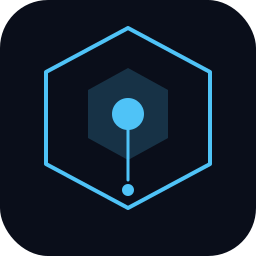

<div align="center">



# easyCodex

**[English](#english) | [中文](#中文)**

One-click install & launch Codex Desktop with DeepSeek for Chinese users.

为国内用户打造的一键安装和启动 Codex 桌面版工具，无需 ChatGPT 账号，直接使用 DeepSeek。

</div>

---

## English

### What is easyCodex?

easyCodex is a Windows desktop application (Electron) that lets anyone install and run **Codex Desktop** with **DeepSeek** as the backend model — no ChatGPT account required.

### How It Works

easyCodex runs a local proxy server (`http://127.0.0.1:18731`) between Codex and DeepSeek:

1. Injects your DeepSeek API key into all requests automatically
2. Translates Codex's OpenAI Responses API calls into DeepSeek Chat Completions API calls
3. Translates streaming responses back in real-time
4. Uses a PROXY_MANAGED placeholder so Codex never needs OpenAI credentials

The architecture mirrors [cc-switch](https://github.com/farion1231/cc-switch), simplified into a single tool focused on DeepSeek.

### Features

- **One-click install** — installs Codex Desktop (bundled package or Microsoft Store)
- **Dependency detection** — checks Node.js, Codex CLI/Desktop; shows status and installs what's missing
- **Single-page UI** — dark theme, large launch button, collapsible config panel
- **DeepSeek API key** — input with visibility toggle and test button
- **Dual models** — DeepSeek V4 Pro (128K context) and V4 Flash (1M context)
- **Configurable context window** — adjustable per model, with sensible defaults
- **Store auto-click** — automatically clicks the install button in Microsoft Store
- **IPv4 forcing** — avoids IPv6 routing issues common on Chinese networks
- **Codex self-update safe** — detector dynamically searches `OpenAI.Codex_*` directories

### Prerequisites

- Windows 10/11 (x64)
- DeepSeek API key — get one at https://platform.deepseek.com/api_keys

Node.js is optional (only needed for Codex CLI).

### Build

```bash
npm install
npm start          # development mode
npm run build      # build installer (.exe)
``+
#### China mirror acceleration

```bash
# Use the dedicated China build script
.\build-cn.ps1

# Or set mirrors manually
$env:ELECTRON_MIRROR = "https://npmmirror.com/mirrors/electron/"
$env:ELECTRON_BUILDER_BINARIES_MIRROR = "https://npmmirror.com/mirrors/electron-builder-binaries/"
npm run build
```

This reduces Electron download time from ~5 min to ~15 sec.

#### Two installer versions

| Version | Script | Size | Description |
|---------|--------|------|-------------|
| Light | `build-light.ps1` | ~78 MB | Downloads Codex from Microsoft Store during install |
| Bundled | `build-bundled.ps1` | ~746 MB | Includes Codex installer offline; falls back to Store if needed |

### Usage

1. **Install** — Run `easyCodex Setup.exe`
2. **Configure** — Open easyCodex, paste your DeepSeek API key, click Save
3. **Launch** — Click the large circular button to start Codex with DeepSeek

The proxy runs automatically in the background whenever easyCodex is open. Your API key is stored locally in `~/.codex/eazycodex.json`.

### Architecture

```
Codex Desktop
    |
    | HTTP (Responses API wire format)
    v
easyCodex Proxy (127.0.0.1:18731)
    |
    | Translate: Responses API → Chat Completions API
    | Inject:    DeepSeek API Key + Model override
    v
DeepSeek API (api.deepseek.com)
```

#### Key Files

| File | Purpose |
|------|---------|
| `src/proxy.js` | Local proxy server with API translation |
| `src/configManager.js` | Writes `config.toml` and `auth.json` |
| `src/detector.js` | Finds Codex installation (version-update safe) |
| `src/installer.js` | Codex installer (bundled → Store → fallback) |
| `src/launcher.js` | Launches Codex Desktop via `shell:AppsFolder` |
| `src/main.js` | Electron main process and IPC handlers |
| `src/preload.js` | Secure IPC bridge |
| `src/renderer/` | Single-page UI (HTML/CSS/JS) |

### DeepSeek Reasoning

Matches cc-switch's DeepSeek config exactly:
`thinking: {type: enabled/disabled}` + `reasoning_effort` at top level
- Effort mapping: `max`/`xhigh` → `max`, everything else → `high`
- Output format: `reasoning_content` field extraction

### License

MIT

---

## 中文

### 什么是 easyCodex？

easyCodex 是一个 Windows 桌面应用（Electron），让任何人都能一键安装并运行 **Codex 桌面版**，使用 **DeepSeek** 作为后端模型 —— 无需 ChatGPT 账号。

### 工作原理

easyCodex 在 Codex 和 DeepSeek 之间运行一个本地代理服务器（`http://127.0.0.1:18731`）：

1. 自动将你的 DeepSeek API Key 注入所有请求
2. 将 Codex 的 OpenAI Responses API 调用翻译为 DeepSeek Chat Completions API
3. 实时翻译流式响应返回
4. 使用 PROXY_MANAGED 占位符，Codex 无需 OpenAI 凭据

架构参考了 [cc-switch](https://github.com/farion1231/cc-switch)，简化为专注于 DeepSeek 的单一工具。

### 功能特性

- **一键安装** —— 自动安装 Codex 桌面版（内置安装包或微软商店）
- **依赖检测** —— 检查 Node.js、Codex CLI/桌面版；显示状态并自动安装缺失项
- **单页界面** —— 深色科技风，大按钮一键启动，配置面板可折叠
- **DeepSeek API Key** —— 输入框支持显示/隐藏切换和测试按钮
- **双模型支持** —— DeepSeek V4 Pro（128K 上下文）和 V4 Flash（1M 上下文）
- **上下文窗口可配置** —— 按模型给出合理默认值，用户可自行调整
- **商店自动点击** —— 自动点击微软商店中的安装按钮
- **强制 IPv4** —— 避免国内网络常见的 IPv6 路由问题
- **Codex 自更新兼容** —— 检测器动态搜索 `OpenAI.Codex_*` 目录

### 环境要求

- Windows 10/11（64 位）
- DeepSeek API Key —— 在 https://platform.deepseek.com/api_keys 获取

Node.js 为可选项（仅 Codex CLI 需要）。

### 构建

```bash
npm install
npm start          # 开发模式
npm run build      # 构建安装包 (.exe)
```

#### 国内镜像加速

```bash
# 使用专用国内构建脚本
.\build-cn.ps1

# 或手动设置镜像
$env:ELECTRON_MIRROR = "https://npmmirror.com/mirrors/electron/"
$env:ELECTRON_BUILDER_BINARIES_MIRROR = "https://npmmirror.com/mirrors/electron-builder-binaries/"
npm run build
```

国内镜像可将 Electron 下载时间从约 5 分钟缩短到约 15 秒。

#### 两个安装包版本

| 版本 | 脚本 | 大小 | 说明 |
|------|------|------|------|
| 精简版 | `build-light.ps1` | ~78 MB | 安装时从微软商店下载 Codex |
| 整合版 | `build-bundled.ps1` | ~746 MB | 内置 Codex 安装包，离线安装；失败则回退到商店 |

### 使用方法

1. **安装** —— 运行 `easyCodex Setup.exe`
2. **配置** —— 打开 easyCodex，粘贴你的 DeepSeek API Key，点击保存
3. **启动** —— 点击大圆形按钮，使用 DeepSeek 启动 Codex

代理服务在 easyCodex 打开时自动在后台运行。API Key 存储在本地 `~/.codex/eazycodex.json`。

### 架构

```
Codex 桌面版
    |
    | HTTP（Responses API 通信格式）
    v
easyCodex 代理 (127.0.0.1:18731)
    |
    | 翻译：Responses API → Chat Completions API
    | 注入：DeepSeek API Key + 模型覆盖
    v
DeepSeek API (api.deepseek.com)
```

#### 关键文件

| 文件 | 用途 |
|------|------|
| `src/proxy.js` | 本地代理服务器，负责 API 翻译 |
| `src/configManager.js` | 写入 `config.toml` 和 `auth.json` |
| `src/detector.js` | 查找 Codex 安装（兼容版本更新） |
| `src/installer.js` | Codex 安装器（内置 → 商店 → 回退） |
| `src/launcher.js` | 通过 `shell:AppsFolder` 启动 Codex 桌面版 |
| `src/main.js` | Electron 主进程和 IPC 处理 |
| `src/preload.js` | 安全 IPC 桥接 |
| `src/renderer/` | 单页界面（HTML/CSS/JS） |

### DeepSeek 推理配置

与 cc-switch 的 DeepSeek 配置完全一致：
`thinking: {type: enabled/disabled}` + 顶层 `reasoning_effort`
- 推理强度映射：`max`/`xhigh` → `max`，其余 → `high`
- 输出格式：提取 `reasoning_content` 字段

### 开源协议

MIT

---

<div align="center">

**壹我AI出品**

</div>
